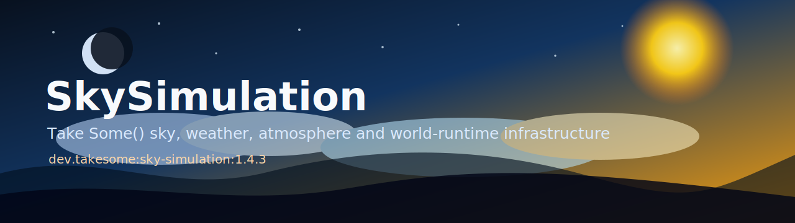

# SkySimulation

<p align="center">
  
</p>

<p align="center">
  <a href="https://github.com/Take-Some/SkySimulation/actions/workflows/push.yml"></a>
  <a href="https://github.com/Take-Some/SkySimulation/actions/workflows/release.yml"></a>
  
  
  
  
</p>

**SkySimulation** is the Take Some() sky and atmosphere package for Java / jMonkeyEngine worlds.

We are **Take Some()** — a small engineering team building game-runtime infrastructure: simulation systems, rendering tools, world technology, and reusable engine modules for our own projects.

This repository turns the original SkyControl-style sky runtime into a Take Some() package with practical controls for modern game worlds: atmospheric tuning, sun and moon texture customization, cloud lighting, stars, horizon haze, and release-ready Gradle publishing.

## What we are building

We are building a reusable world-simulation layer for our games and engine experiments:

- dynamic sky, sun, moon, stars, haze, and cloud layers;
- configurable atmospheric lighting profiles;
- texture customization for both the sun and the moon;
- lighting synchronization for ambient light, directional light, bloom, shadows, and viewport background color;
- package distribution through Maven Local and GitHub Packages;
- a foundation for richer worlds, weather, time-of-day systems, and future Take Some() engine modules.

The public Java namespace currently remains compatible with SkyControl:

```java
import jme3utilities.sky.SkyControl;
import jme3utilities.sky.SkyAtmosphere;
```

That keeps existing code usable while the artifact itself is published under Take Some() coordinates.


## Source layout

The public API stays in the stable `jme3utilities.sky` namespace:

```text
SkyControl
SkyControlCore
SkyMaterial / SkyMaterialCore
SkyAtmosphere
CloudLayer
SunAndStars
Updater
```

Implementation helpers are grouped by responsibility in focused packages:

```text
jme3utilities.sky.atmosphere  atmospheric parsing and lighting math
jme3utilities.sky.material    texture sampling helpers
jme3utilities.sky.scene       scene-graph naming helpers
jme3utilities.sky.update      live updater application helpers
```

Some helper classes remain package-private in `jme3utilities.sky` when moving
those classes would force us to expose constructors or state that should stay
encapsulated. Public compatibility is preferred over cosmetic directory moves.

## Cloud weather and generated sky materials

Version `1.4.3` extracts weather subscription dispatch from the environment runtime, reduces per-event allocation during weather notifications, and keeps cloud/weather runtime state observable for gameplay systems.

- `SkyCloudPreset` provides `CLEAR`, `FAIR`, `OVERCAST`, `WISPY`, `CLOUDY`, `RAIN`, `STORM`, and `NIMBUS`.
- `SkyControl.setCloudPreset(preset, seconds)` changes weather by fading current layers out, swapping alpha/normal/scale/motion while invisible, and fading target layers in.
- DDS resources live under `SkyLibrary/src/main/resources/Textures/skies/clouds/presets`.
- `cloud-weather-presets.json` records managed presets, raw bundles, DDS inventory, SHA-256 values, transition policy, and generated material/shader settings.
- `:SkyAssets:skyMaterials` generates `dome02`, `dome06`, `dome20`, `dome22`, `dome60`, and `dome66` MatDefs and GLSL shaders.
- BC5/ATI2 DDS normal maps are supported through the first-party fallback loader and are mapped to `Image.Format.RGTC2`.

Visual smoke test:

```bat
gradlew.bat :SkyExamples:SkyCloudWeatherSmoke
```


## Package

### Release package

```kotlin
repositories {
    mavenCentral()
    maven {
        url = uri("https://maven.pkg.github.com/Take-Some/SkySimulation")
        credentials {
            username = findProperty("gpr.user") as String? ?: System.getenv("GITHUB_ACTOR")
            password = findProperty("gpr.key") as String? ?: System.getenv("GITHUB_TOKEN")
        }
    }
}

dependencies {
    implementation("dev.takesome:sky-simulation:1.4.3")
}
```

### Local development package

First install the package into Maven Local:

```bat
gradlew.bat packageLocal
```

Then use it from another Gradle project:

```kotlin
repositories {
    mavenLocal()
    mavenCentral()
}

dependencies {
    implementation("dev.takesome:sky-simulation:1.4.3-SNAPSHOT")
}
```

## Build

Requirements:

- JDK 17+
- Gradle wrapper from this repository

Common commands:

```bat
gradlew.bat :SkyLibrary:compileJava
gradlew.bat :SkyLibrary:checkstyleMain
gradlew.bat packageLocal
```

Build release artifacts locally:

```bat
gradlew.bat :SkyLibrary:assemble -PskySimulationVersion=1.4.3
```

Artifacts are generated in:

```text
SkyLibrary/build/libs
```

## Release

A GitHub release is produced by pushing a version tag:

```bat
git tag -a v1.4.3 -m "SkySimulation v1.4.3"
git push origin v1.4.3
```

The release workflow publishes the Maven package to GitHub Packages and attaches the JAR, sources, Javadoc, POM, and Gradle module metadata to the GitHub Release.

## Modules

- `SkyLibrary` — runtime library and public API.
- `SkyAssets` — generated sky, star, sun, moon, cloud, and haze textures.
- `SkyExamples` — example applications and test scenes.

## Current Take Some() additions

- `SkyAtmosphere` profile for atmospheric lighting and realism tuning.
- `earthlike-atmosphere.properties` default tuning preset.
- Explicit `setSunTexture(...)` and `setMoonTexture(...)` APIs.
- `clearMoonTexture()` for returning to phase-preset moon textures.
- GitHub Packages publishing under `dev.takesome:sky-simulation`.
- Release workflow for GitHub Releases.
- `SkyCloudPreset` weather presets with gradual transitions.
- DDS cloud preset resources plus `cloud-weather-presets.json` registry.
- Generated sky MatDefs/GLSL via `:SkyAssets:skyMaterials`.
- BC5/ATI2 DDS normal-map fallback loader for cloud normals.
- Smooth atmosphere transitions for gradient style, sunset intensity, and halo intensity.
- Game-facing weather subscriptions for exact weather ids, storm-like states, precipitation thresholds, wind thresholds, and all weather changes.
- Expanded logging for Lua weather ABI loading, cloud preset transitions, generated sky material creation, and compressed DDS/BC cloud texture metadata.

## Attribution

SkySimulation is based on the SkyControl project lineage and keeps the BSD-style license terms from the original codebase. Take Some() maintains this fork for our own engine/runtime work while preserving compatibility where it matters.

See `LICENSE` and source headers for license details.
